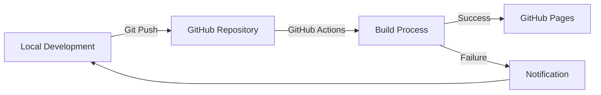

# Technical Design and Implementation Specification (TDIS)

## Specification Documents

### 1. Technical Requirements

#### Development Environment
- Operating System: Windows
- Static Site Generator: Hugo (Extended Version)
- Version Control: Git
- Deployment Platform: GitHub Pages
- Build System: GitHub Actions

#### Performance Requirements
- Page Load Time: < 2s for initial load
- Google Lighthouse Scores:
  - Performance: > 90
  - Accessibility: > 95
  - Best Practices: > 95
  - SEO: > 95

#### Browser Support
- Chrome (latest 2 versions)
- Firefox (latest 2 versions)
- Edge (latest 2 versions)
- Safari (latest 2 versions)

### 2. Content Architecture

#### Content Types
1. Technical Blog Posts
   ```yaml
   type: blog
   fields:
     title: string
     date: datetime
     categories: string[]
     tags: string[]
     series: string?
     difficulty: enum[beginner,intermediate,advanced]
     timeToRead: number
     summary: string
     content: markdown
   ```

2. Project Showcases
   ```yaml
   type: project
   fields:
     title: string
     date: datetime
     status: enum[completed,in-progress,planned]
     technologies: string[]
     github: url?
     demo: url?
     thumbnail: image
     content: markdown
   ```

3. Learning Journey Updates
   ```yaml
   type: journey
   fields:
     title: string
     date: datetime
     topic: string
     progress: number
     milestones: string[]
     nextSteps: string[]
     content: markdown
   ```

4. Personal Content
   type: gaming
   fields:
     title: string
     date: datetime
     categories: string[]
     thumbnail: image?
     relatedProfessional: string[]
     content: markdown

   type: interests
   fields:
     title: string
     date: datetime
     categories: string[]
     relatedProfessional: string[]
     content: markdown

#### URL Structure
```
/                           # Home
/professional/              # Professional content hub
  /blog/                    # Technical blog posts
    /{slug}/               
  /projects/               # Project showcases
    /{slug}/
  /journey/                # Learning progress
    /{slug}/
/personal/                 # Personal content hub
  /gaming/                 # Gaming analysis
    /{slug}/
  /interests/              # Other interests
    /{slug}/
```

### 3. Build and Deployment Specifications

#### Development Workflow


#### Build Process
1. Content Validation
   - Front matter validation
   - Link checking
   - Image optimization
2. Hugo Build
   - Environment-specific configuration
   - Asset pipeline processing
3. Post-Processing
   - HTML minification
   - CSS/JS optimization
   - Image compression
4. Deployment
   - GitHub Pages publication
   - Cache invalidation

## Project Implementation Plan

### 1. Environment Setup (Windows-Specific)

1. Install Required Software:
   ```powershell
   # Install Chocolatey (Run as Administrator)
   Set-ExecutionPolicy Bypass -Scope Process -Force; [System.Net.ServicePointManager]::SecurityProtocol = [System.Net.ServicePointManager]::SecurityProtocol -bor 3072; iex ((New-Object System.Net.WebClient).DownloadString('https://community.chocolatey.org/install.ps1'))
   
   # Install Hugo Extended
   choco install hugo-extended -confirm
   
   # Install Git
   choco install git -confirm
   ```

2. Configure Git:
   ```powershell
   git config --global user.name "Your Name"
   git config --global user.email "your.email@example.com"
   git config --global core.autocrlf true  # Windows-specific
   ```

3. Create Project Structure:
   ```powershell
   hugo new site portfolio
   cd portfolio
   git init
   ```

### 2. Folder Structure Implementation

```
portfolio/
├── archetypes/               # Content templates
│   ├── blog.md              # Blog post template
│   ├── project.md           # Project template
│   └── journey.md           # Learning journey template
├── config/                  # Configuration files
│   ├── _default/
│   │   ├── config.toml      # Base configuration
│   │   ├── menus.toml      # Navigation menus
│   │   └── params.toml     # Theme parameters
│   └── production/
│       └── config.toml      # Production overrides
├── content/                 # Content files
├── layouts/                 # Template files
│   ├── _default/
│   │   ├── professional/
│   │   │   ├── list.html      # Professional section list template
│   │   │   └── single.html    # Professional content template
│   │   └── personal/
│   │       ├── list.html      # Personal section list template
│   │       └── single.html    # Personal content template
│   └── partials/
│       └── metadata/
│           ├── professional.html  # Professional metadata template
│           └── personal.html      # Personal metadata template
├── static/                  # Static assets
└── themes/                  # Hugo theme
└── assets/
    ├── css/
    │   ├── professional.css   # Professional section styles
    │   ├── personal.css      # Personal section styles
    │   ├── metadata.css      # Shared metadata styles
    │   └── taxonomy.css      # Taxonomy and term styles
```

### 3. Content Management Workflow

#### Content Creation Process
1. Create new content:
   ```powershell
   hugo new professional/blog/post-title.md
   ```

2. Front Matter Template:
   ```yaml
   ---
   title: "Post Title"
   date: {{ .Date }}
   draft: true
   categories: []
   tags: []
   series: ""
   difficulty: "intermediate"
   timeToRead: 0
   summary: ""
   ---
   ```

3. Build and Preview:
   ```powershell
   hugo server -D  # Include drafts
   ```

#### Content Publishing Checklist
- [ ] Front matter complete
- [ ] Content reviewed
- [ ] Images optimized
- [ ] Code samples tested
- [ ] Links verified
- [ ] SEO metadata added
- [ ] Draft status removed

### 4. Development Standards

#### Code Style
- Use 2-space indentation
- Follow Hugo template best practices
- Implement BEM methodology for CSS
- Use semantic HTML elements

#### Git Workflow
- Main branch: production-ready code
- Development branch: active development
- Feature branches: new features/content
- Commit message format:
  ```
  type(scope): description
  
  [optional body]
  ```

### 5. Quality Assurance

#### Testing Checklist
- [ ] Cross-browser compatibility
- [ ] Mobile responsiveness
- [ ] Performance metrics
- [ ] Accessibility compliance
- [ ] SEO requirements
- [ ] Content rendering
- [ ] Navigation functionality

#### Monitoring Tools
- Google Analytics
- Google Search Console
- GitHub Actions status
- Lighthouse CI

## Getting Started

1. Clone Repository Template:
   ```powershell
   git clone https://github.com/your-username/portfolio.git
   cd portfolio
   ```

2. Install Dependencies:
   ```powershell
   # If using npm for additional tools
   npm install
   ```

3. Start Development Server:
   ```powershell
   hugo server -D
   ```

4. Access Development Site:
   ```
   http://localhost:1313
   ```

## Implementation Progress Tracker

### Phase 1: Initial Setup
- [x] Install Required Software
  - [x] Install Chocolatey
  - [x] Install Hugo Extended
  - [x] Install Git
  - [x] Configure Git global settings
- [x] Create GitHub Repository
  - [x] Initialize with README
  - [x] Set up branch protection rules
  - [x] Configure GitHub Pages
- [x] Set Up Local Development Environment
  - [x] Create new Hugo site
  - [x] Initialize Git repository
  - [x] Set up remote origin

### Phase 2: Base Configuration
- [x] Hugo Configuration
  - [x] Set up config.toml
  - [x] Configure theme
  - [x] Set up environment-specific configs
- [x] Create Folder Structure
  - [x] Set up content directories
  - [x] Create layout templates
  - [x] Configure static assets
- [x] Template Development
  - [x] Create base templates
  - [x] Implement partials
  - [x] Set up shortcodes

### Phase 3: Content Structure
- [x] Create Content Types
  - [x] Blog post archetype
  - [x] Project showcase archetype
  - [x] Learning journey archetype
- [x] Implement Taxonomies
  - [x] Categories
  - [x] Tags
  - [x] Series
- [x] Set up Content Sections
  - [x] Professional section
  - [x] Personal section

### Phase 4: Development Pipeline
- [x] GitHub Actions Setup
  - [x] Create workflow file
  - [x] Configure build process
  - [x] Set up deployment
    - [x] Fix workflow errors
      - [x] Use correct repository name for Lighthouse package
      - [x] Use Ubuntu environment instead of Windows
      - [x] Fix configs for taxonomies
      - [x] Add home page and related components
      - [x] Remove testing from remote server and keep it local
  - Verify  GitHub Page running
- [ ] Quality Checks
  - [ ] HTML validation
  - [ ] Link checking
  - [ ] Performance testing
- [ ] Analytics and Monitoring
  - [ ] Set up Google Analytics
  - [ ] Configure Search Console
  - [ ] Implement error tracking

### Phase 5: Initial Content
- [ ] Migrate Existing Content
  - [ ] Convert coin change article
  - [ ] Set up code highlighting
  - [ ] Configure math rendering
- [ ] Create Essential Pages
  - [ ] Home page
  - [ ] About page
  - [ ] Blog index
  - [ ] Projects index

### Phase 6: Launch Preparation
- [ ] Testing
  - [ ] Cross-browser testing
  - [ ] Mobile responsiveness
  - [ ] Performance optimization
- [ ] SEO Implementation
  - [ ] Meta descriptions
  - [ ] Sitemap
  - [ ] Robots.txt
- [ ] Documentation
  - [ ] Update TDIS
  - [ ] Update CSEG
  - [ ] Create deployment docs

Each task should be marked as complete in this tracker as it is finished. The tracker should be updated regularly to reflect current progress and any new tasks that are identified during development.

This specification serves as the canonical source of truth for the project. Updates to this document should be tracked in version control with appropriate review and approval processes.